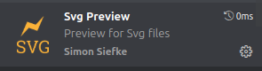

## Clone the repository

```bash
git clone https://github.com/mathias8dev/M1_Sorbonne_SysCom_UM4RBT11-UM4EE109_Projet.git
```

## Open the repository in VSCode

Just open a new vscode window and open the repo folder.
Or if vscode is in your path as vscode or code (maybe you give it another name), you can just do after cloning the repo:

```bash
cd M1_Sorbonne_SysCom_UM4RBT11-UM4EE109_Projet
code .
```

---

For now, we will suppose that the project is opened in your vscode.


## Setup & Run
In a terminal, place yourself at the root of the project folder.

Run the following commands to create a virtual environment, install dependencies, and start the app:

<h4> Linux or MacOs </h4>

```bash
python3 -m venv .venv
source .venv/bin/activate
pip install -r requirements.txt
python3 app/src/main.py
```

<h4> Windows </h4>

```bash
python3 -m venv .venv
.venv/Scripts/activate
pip install -r requirements.txt
python3 app/src/main.py
```

## Visualize the UML diagram of our implementation

There is 3 ways to do that. Since our uml diagram is written in mermaid, 

- You can copy and paste the code inside the .mermaid file (docs/design/class_diagram.mermaid) in a mermaid editor. (You can basically just use this one: https://mermaid.live/ )

- You can install a mermaid previewer extension in your vscode and just preview the mermaid code with it

- You can use the class_diagram.svg(docs/design/class_diagram.svg) file which actually is the svg version of our diagram and just open it with an svg viewer (maybe directly inside vscode or with an external svg viewer)


### Nota

We recommend to install these extensions to preview the .svg and the .mermaid files directly on vscode if you choose this option.

- For SVG preview



- For Mermaid preview


## Troubleshoot
- Sometime, python 3 can be in your path as python. Therefore, the command **python3** will not work and you should use **python** instead. Also, if the installation of python is not well done (specially on windows), python could not be in the path at all. Please look on internet to learn how to fix that.

